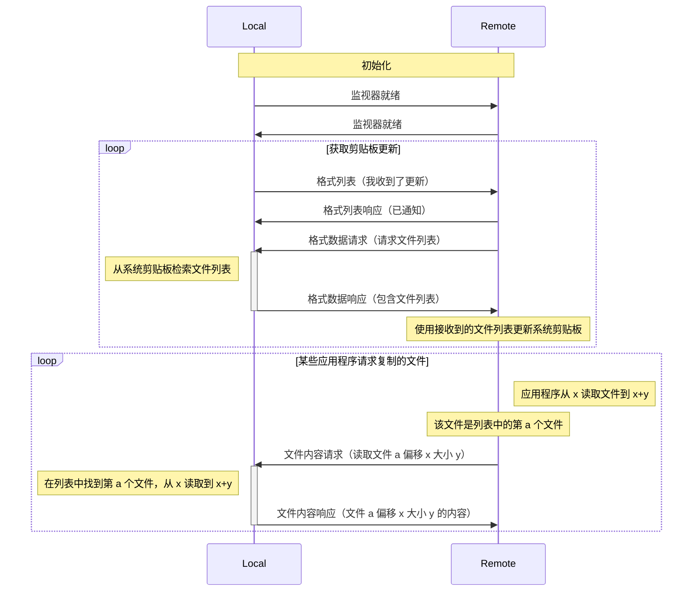

# clipboard

通过网络复制文件和文本。
主要底层逻辑来自 [FreeRDP](https://github.com/FreeRDP/FreeRDP)。

要在 Linux/OSX 上使用文件复制和粘贴功能，
请使用 `unix-file-copy-paste` 特性构建。

TODO: 将此库移动到单独的项目中。

## 工作原理

术语：

- cliprdr: 此模块
- local: 发起文件复制事件的端点
- remote: 粘贴从 `local` 复制的文件的端点

复制和粘贴文件的主要算法来自
[Remote Desktop Protocol: Clipboard Virtual Channel Extension](https://winprotocoldoc.blob.core.windows.net/productionwindowsarchives/MS-RDPECLIP/%5bMS-RDPECLIP%5d.pdf)，
可以总结为：

0. local 和 remote 相互通知已准备就绪。
1. local 订阅/监听系统剪贴板的文件复制事件
2. local 一旦收到文件复制事件，通知 remote
3. remote 确认接收并尝试拉取文件列表
4. local 更新其文件列表，remote 将拉取的文件列表刷新到剪贴板
5. remote 操作系统或桌面管理器发起粘贴操作，使其他程序读取
   剪贴板文件。将这些读取请求转换为 RPC

   - 在 Windows 上，所有文件读取都将通过流文件 API 进行
   - 在 Linux/OSX 上，使用 FUSE 将读取请求转换为 RPC
     - 为了防止本地剪贴板被传输回来
       导致死循环，
       所有指向 FUSE 目录的文件复制事件都将被忽略

6. 逐个完成所有文件的粘贴。

从网络数据传输的角度来看：



注意：在实际实现中，双方都可以发送剪贴板更新
和请求文件内容。
没有限制只有 local 可以更新剪贴板
并将文件复制到 remote。

## 实现

### windows


该协议最初设计为 Windows RDP 的扩展，
因此特定的消息包很适合 Windows。

启动 cliprdr 时，会生成一个线程来创建一个不可见的窗口
并订阅 OLE 剪贴板事件。
窗口的回调函数（参见 `src/windows/wf_cliprdr.c` 中的 `cliprdr_proc`）
被设置为处理各种事件。

详细实现如上图所示。

### Linux/OSX

Cliprdr Server 实现主要有 3 个部分：

- 剪贴板客户端
- 本地文件列表
- FUSE 服务器

#### 剪贴板客户端

剪贴板客户端有一个线程轮询剪贴板上的文件 URL。

如果客户端发现任何文件 URL 的更新，
在过滤掉指向我们 FUSE 目录或重复的文件后，
直接向 remote 发送格式列表。

cliprdr 服务器还使用剪贴板客户端来设置剪贴板，
或从系统检索路径。

#### 本地文件列表

本地文件列表是文件元数据的临时列表。
当接收到来自对端的文件内容 PDU 时，服务器会选择
所请求的文件并在必要时打开它进行读取。

同样，当接收到来自 remote 的格式数据请求 PDU 询问文件列表时，
本地文件列表应该从剪贴板客户端检索的文件列表重建。

可以对其进行一些缓存和预加载，因为应用程序很可能会
按顺序读取列表。

#### FUSE 服务器

FUSE 服务器可以将 POSIX 文件读取请求转换为文件内容
请求/响应 RPC。

当接收到来自 remote 的文件列表时，
FUSE 服务器会计算出文件系统树并重新排列其内容。

#### 杂项

- 该协议最初为 Windows 实现，
  因此 PDU 中的路径都将转换为 UTF-16 LE 编码的 DOS 格式，
  日期时间将转换为 LDAP 时间戳而不是
  Unix 时间戳

  ```text
  UNIX
  /usr/bin/rustdesk
  ->
  DOS
  \usr\bin\rustdesk
  ```

- 为了更好地适应在类 Unix 平台上保留权限，
  FileDescriptor PDU 的保留区域

- 您可能会注意到
  应用程序退出后挂载点仍然被占用。
  这是因为 FUSE 服务器未使用 `AUTO_UNMOUNT` 挂载。
  - 很难为多进程程序实现优雅关闭
  - `AUTO_UNMOUNT` 默认未启用，需要在配置中启用
    `user_allow_other`。让用户编辑此类全局
    配置来使用此功能可能不是一个好主意。
  - 使用 [`umount()`](https://man7.org/linux/man-pages/man2/umount.2.html)
    系统调用卸载也需要该选项。
  - 我们目前直接调用 [`umount`](https://man7.org/linux/man-pages/man8/umount.8.html)
    程序来卸载悬挂的 FUSE 服务器。目前运行良好。
